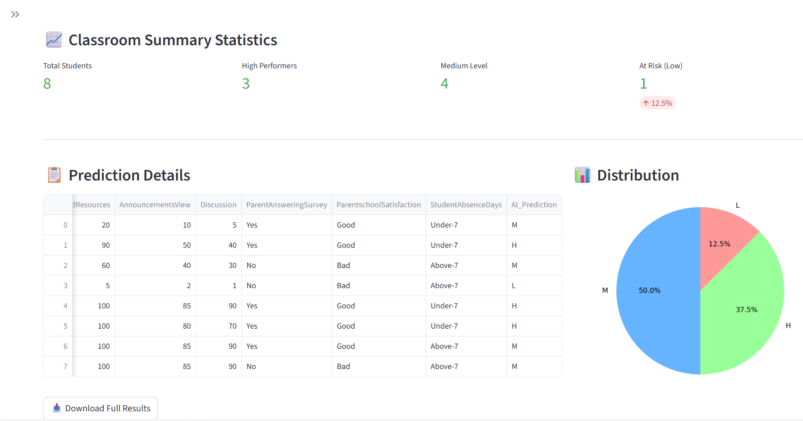
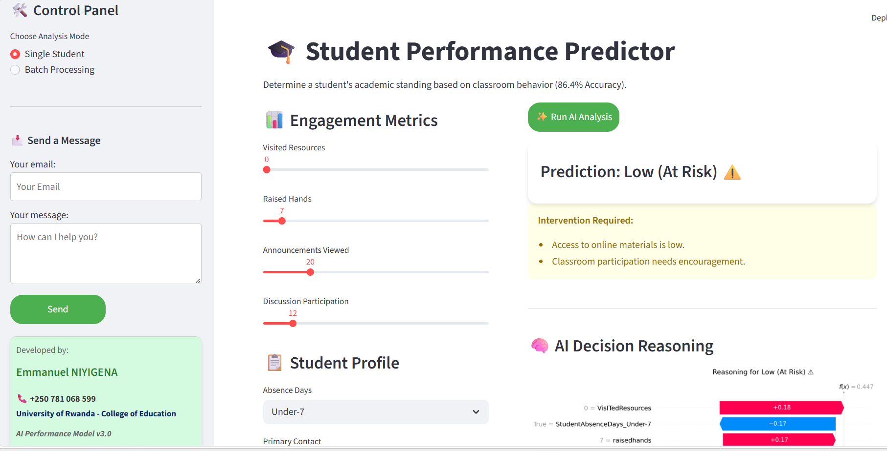
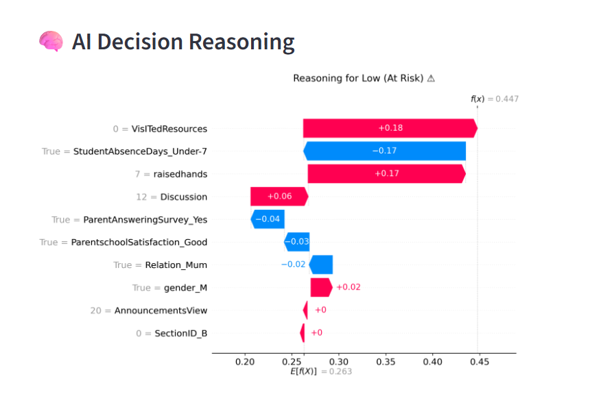
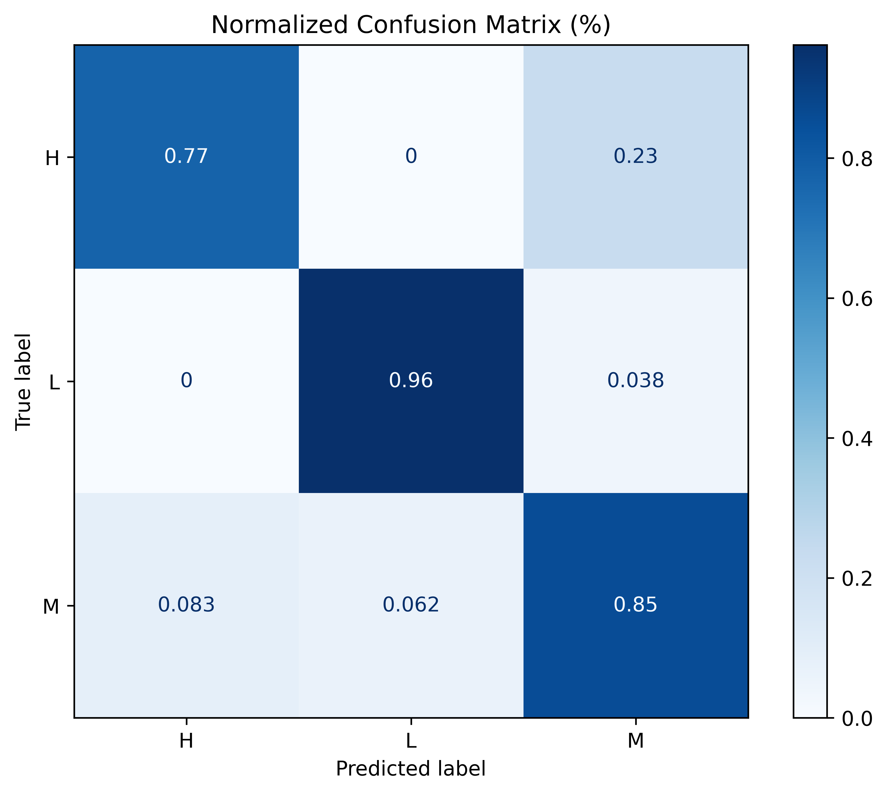
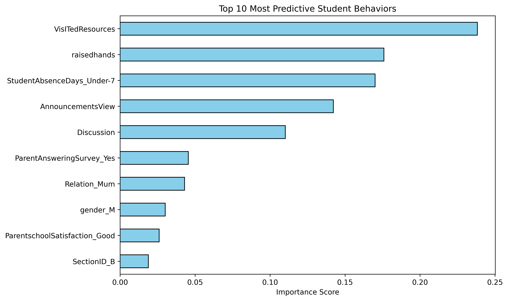

## 🎓 EduPredict AI: *Student Performance Analysis System*

[](https://your-real-link.streamlit.app)


**EduPredict AI** is a machine learning–powered decision-support tool designed to help educators identify at-risk students early in the semester using behavioral analytics derived from LMS activity. <br>
The system analyzes 10 key engagement metrics to predict academic performance with *86.4% accuracy* model.

## 🌟 Project Overview

Traditional grading systems often detect struggling students too late, after academic performance has already declined.<br>

EduPredict AI introduces a proactive analytics approach that leverages student digital footprints to detect warning signs early.<br>
Using machine learning, the system evaluates behavioral signals such as:<br>
•  class participation  
•	resource engagement  
•	discussion activity  
•	attendance patterns  
and predicts student academic performance.

## 🚀 Key Features <br>

  **Individual Predictor**:  Predict academic performance for a single student using engagement metrics.  
  **Explainable AI (SHAP)**:  Provides visual explanations showing why the model made a prediction.  
  **Batch Processing**:  Upload CSV or Excel files to analyze entire classrooms instantly.  
  **Teacher Action Plan**:  Automatically generates pedagogical recommendations to help educators support struggling students.  


## 🧠 Machine Learning Model

The predictive engine is based on a *Random Forest Classifier* optimized using *GridSearchCV*.  

*Performance metrics:*

   | Metric | Score |
   | :--- | :--- |
   | Accuracy | 86.46% |
   | Cross-validation | 71.25% |

## 📊 Dataset

This project uses the *xAPI-Edu-Data* dataset, which contains behavioral and demographic data collected from a Learning Management System.  

Key variables include:  
•	raisedhands  
•	VisITedResources  
•	AnnouncementsView  
•	Discussion  
•	StudentAbsenceDays  <br>
These engagement indicators help predict academic performance categories:  
•	Low  
•	Medium  
•	High  

## 📜 Dataset License

   Dataset licensed under:  
      Creative Commons Attribution 4.0 International License  

   Citation:  
      Amrieh, E. A., Hamtini, T., & Aljarah, I. (2016).  
      Students' Academic Performance Dataset (xAPI-Edu-Data).  


## 🛠️ Technology Stack


| Component | Technology |
| :--- | :--- |
| Model | Random Forest Classifier (Tuned via GridSearchCV) |
| Machine Learning | Scikit-learn |
| Data Processing | Pandas |
| Web Interface | Streamlit |
| Explainable AI | SHAP (SHapley Additive exPlanations) |
| Visualization | Matplotlib |

## 📂 Project Structure
```text
EduPredict-AI
 |----app.py
 |----final_slim_model.pkl
 |----top_10_features.pkl
 |----requirements.txt
 |----batch_test_students.csv
 |----README.md
 |----research_paper.pdf
 |----screenshots
        |
        |----Batch_prediction.png
        |----confusion_matrix.png
        |----SHAP_visualisation.png
        |----single_student_prediction.png
        |----feature_importance_ranking.png
        
```
## ▶️ Running the Project 

   ## 1. Install dependencies:
```bash
           pip install pandas numpy matplotlib scikit-learn shap streamlit
```
   ## 2. Run the application:

```bash
           streamlit run app.py
```
Then app will open in your default browser.


## 📄 Research Paper  
[Download Research Paper](research_paper.pdf)


## 👨‍💻 Author 

Emmanuel NIYIGENA  
Master of Educational Technology  
University of Rwanda – College of Education  

## ❤️ Acknowledgements

Special thanks to the creators of the xAPI-Edu-Data dataset for making educational data publicly available for research.


## ▶️Run the app: [](https://your-real-link.streamlit.app)


## 📷 Screenshots 

  <br>
  <br>
  <br>
  <br>
  <br>


